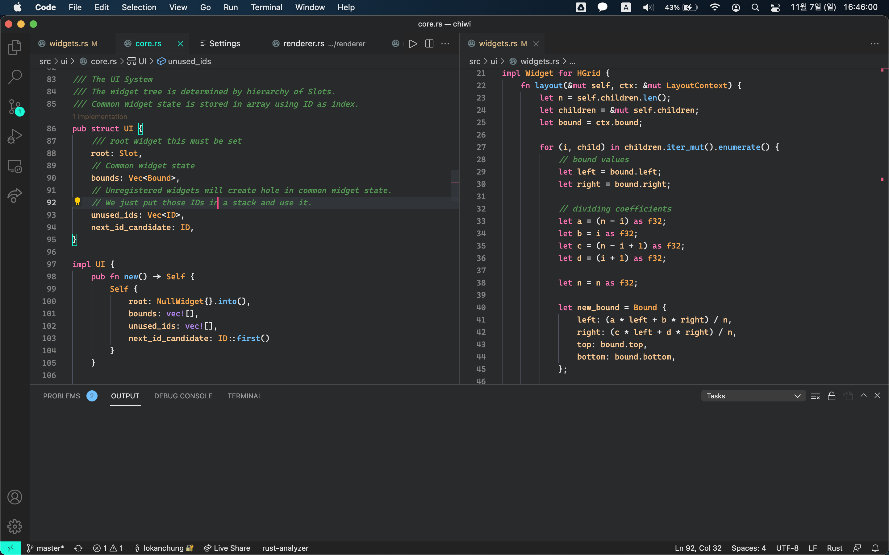

# Passion Fruit Theme 
## Code with Passion!!
This theme is based on panda syntax. 

Passion Fruit theme is tropical theme color scheme that are consistent and easy on eyes.

Color palettes:
* Comments:  `#559955`
* Keywords:  `#FF75B5`
* Variables:  `#FFCC95`
* Types:  `#FDA950`
* Functions:  `#6FC1FF`
* Macros:  `#B084EB`

Supported Languages:
* Rust

* Json

To be supported:
* Javascript
